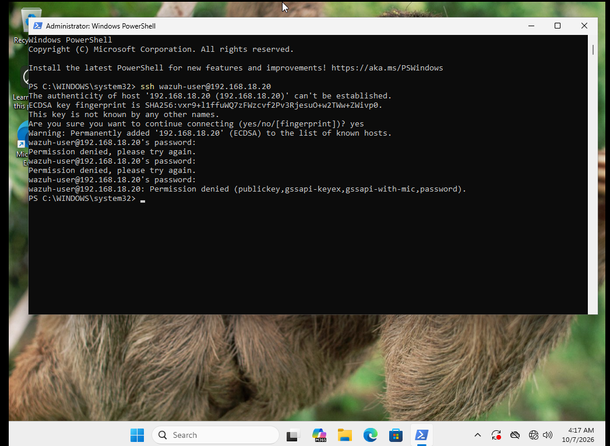
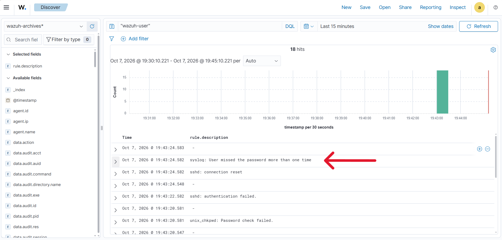
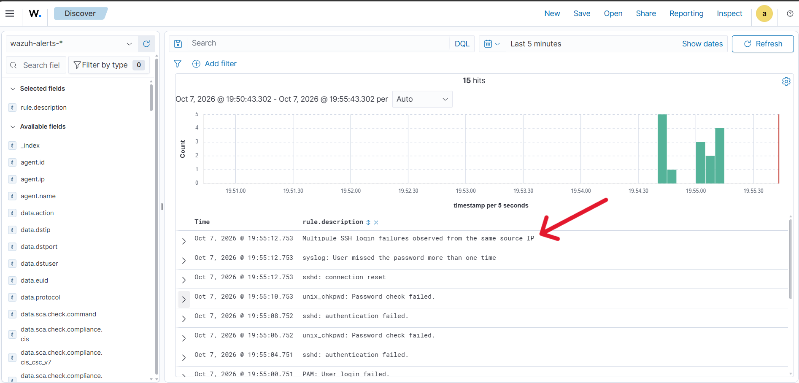
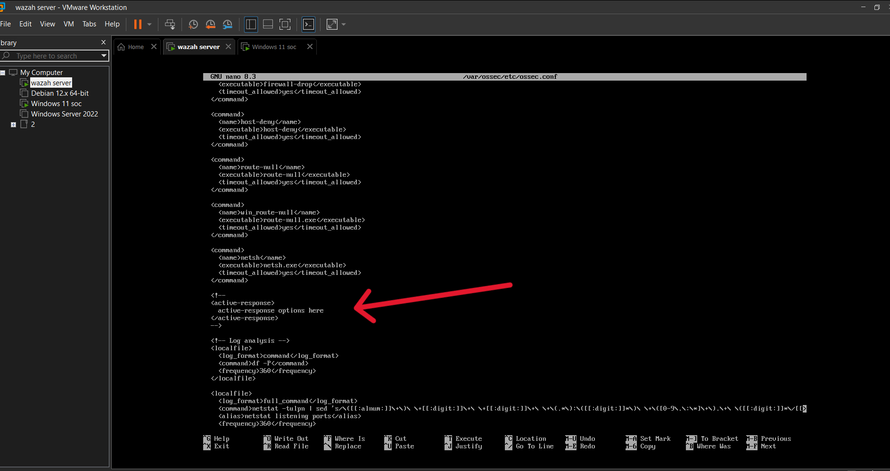
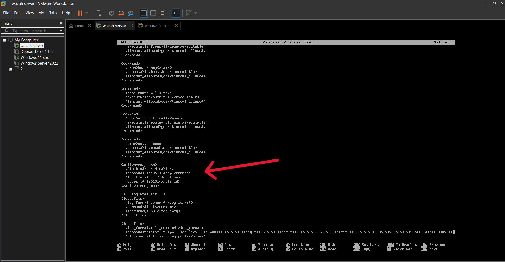
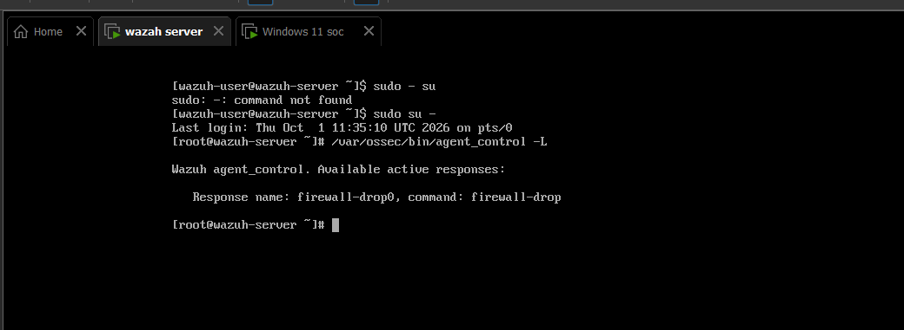
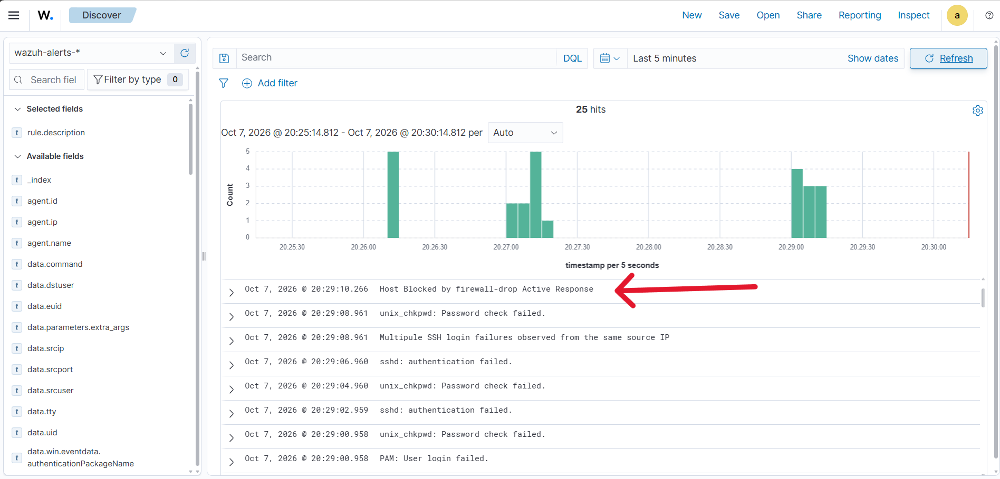

# Active Response

This folder documents a Wazuh active response demo for repeated SSH authentication failures (simulated SSH brute-force). It shows how the attack is detected in Discover, how the custom rule is created, how the active response is configured in `/var/ossec/etc/ossec.conf`, how to verify it from the CLI, and how the source IP is blocked after the simulated attack repeats.

## Structure

- `README.md` (this file)
- `local_rule_snippet.xml` (local rule XML used in the demo)
- `AR-screen-shots/` (screenshot folder for the demo)

## 1) SSH attack demo
This screenshot shows the SSH attack demo. It demonstrates repeated failed SSH login attempts from the attacking host to the target host. The attacker repeatedly tries to authenticate as `wazuh-user` with incorrect passwords. This simulates an SSH brute-force or credential-guessing attempt.



## 2) How Wazuh shows the alert in Discover
This screenshot is from Wazuh Discover. The highlighted row shows the generated detection event under the `rule.description` field. Wazuh writes detection events to the `wazuh-*` indices, and Discover lists them with timestamps and summary details. In this case, the event shows that multiple failed login attempts were observed from the same source IP.



## 3) Rule creation
The custom local rule used in this demo is stored in the file `local_rule_snippet.xml` in this folder. The rule detects repeated SSH login failures and triggers only when the same source IP generates multiple failed attempts within the configured timeframe.

### Rule XML
```xml
<group name="local,syslog,sshd,authentication_failed,">
  <rule id="100101" level="10" frequency="3" timeframe="120">
    <if_matched_sid>5760</if_matched_sid>
    <same_source_ip />
    <description>Multiple SSH login failures observed from the same source IP</description>
    <mitre>
      <id>T1110</id>
    </mitre>
    <group>authentication_failed,ssh_bruteforce,credential_access,</group>
  </rule>
</group>
```

### Explanation of each line
- `<group name="local,syslog,sshd,authentication_failed,">`
  - Labels the rule with categories so it can be grouped and searched.
- `<rule id="100101" level="10" frequency="3" timeframe="120">`
  - `id` gives the rule a unique identifier.
  - `level` assigns the severity level.
  - `frequency="3"` means three matching events must occur.
  - `timeframe="120"` means those events must happen within 120 seconds.
- `<if_matched_sid>5760</if_matched_sid>`
  - The rule only evaluates after a previous rule/decoder with SID 5760 matches.
- `<same_source_ip />`
  - Ensures the events came from the same source IP.
- `<description>Multiple SSH login failures observed from the same source IP</description>`
  - This is the message shown in Wazuh alerts.
- `<mitre><id>T1110</id></mitre>`
  - Maps the detection to the MITRE ATT&CK technique for brute force.
- `<group>authentication_failed,ssh_bruteforce,credential_access,</group>`
  - Adds tags for classification and detection grouping.

## 4) Rule works after repeating the simulated attack
After repeating the SSH brute-force simulation, the rule fires and creates an alert in Discover. The arrow in the screenshot points to the alert line showing: `Multiple SSH login failures observed from the same source IP`.

This confirms that the detection logic works as expected once the attack is repeated.



## 5) Active response location
The active response configuration is located on the Wazuh server at:

`/var/ossec/etc/ossec.conf`

This is the file where active response rules and commands are configured.



## 6) Changes made for active response to work


These are the changes made in the configuration to get the active response working:

- First, the arrows and the `!` mark were removed because Wazuh interpreted them as comments.
- Then the `disabled` element was added with no command to allow the response to be enabled properly.
- After that, the command was added along with the command name.
- The command name must exactly match the name of the command defined above, or it will not work.
- Then the `location` was added with the value `local`, which means the source IP that is making the attack will be blocked locally.
- Finally, the `rule_id` value was added to reference the custom rule created earlier.

This is the configuration concept used:

```xml
<active-response>
  <command>host-deny</command>
  <location>local</location>
  <rules_id>100101</rules_id>
  <disabled>no</disabled>
</active-response>
```


## 7) CLI command used to show the active response is working



The command shown in the screenshot is:

`/var/ossec/bin/agent_control -L`

This command lists all currently activated active-response entries on the Wazuh manager.
Each line in the output shows the response name and the command name.

## 8) Active response working after the SSH attack is repeated
After the SSH attack is repeated, the active response successfully blocks the attacker IP at the firewall. The arrow in the screenshot points to the blocked source IP or firewall restriction, confirming that the full flow works:



- SSH attack attempts trigger the custom rule
- The rule fires in Wazuh
- The active response is invoked
- The firewall blocks the attacking source IP

