# Home SOC Lab 🔐

A practical home SOC lab built to practice security monitoring,
log collection, detection, and incident investigation.

## 🏗️ Lab Environment:

- VMware Workstation
- Wazuh Manager
- Wazuh Indexer
- Wazuh Dashboard
- Windows Server 2022
- Active Directory
- Windows 11 Endpoint
- Kali Linux
- Wazuh Agent
- Sysmon

## 🌐 Lab Architecture


                  ┌─────────────────────┐
                  │   Windows Server    │
                  │   2022 + AD/DNS     │
                  │    soclab.local     │
                  └─────────────────────┘

                  ┌─────────────────────┐
                  │    Windows 11       │
                  │   Sysmon + Agent    │
                  └──────────┬──────────┘
                             │
                             ▼
                  ┌─────────────────────┐
                  │   Wazuh Manager     │
                  │      + Indexer      │
                  │     + Dashboard     │
                  └─────────────────────┘
                             ▲
                             │
                  ┌──────────┴──────────┐
                  │     Kali Linux      │
                  │  Attack Simulation  │
                  └─────────────────────┘

🔍 What I Practiced:

VMware virtual lab deployment
Network configuration and static IPs
Active Directory deployment
Windows domain joining
Wazuh Manager and Agent setup
Sysmon installation and configuration
Windows Event Log collection
SIEM monitoring with Wazuh
Log analysis and alert investigation
Troubleshooting real infrastructure issues

🔄 Logging Pipeline:

Windows 11
    ↓
Sysmon
    ↓
Wazuh Agent
    ↓
Wazuh Manager
    ↓
Wazuh Indexer
    ↓
Wazuh Dashboard

✅ Current Status:

The initial SOC lab environment is operational.
Windows endpoint events are successfully collected through
Sysmon and Wazuh and are available for investigation through
the Wazuh Dashboard.

I have started actively generating logs (by running simulated activities
and tests) and confirmed that those events are being ingested and
displayed in the Wazuh Dashboard's event view and discovery panels.
Below is evidence showing generated logs visible in the Dashboard.

## 🚀 Next Steps:

Simulate attacks from Kali Linux
Generate security events
Investigate Wazuh alerts
Analyze Sysmon events
Build detection scenarios
Practice incident response

🎯 Goal:

Build practical blue-team and SOC analyst skills through
hands-on experimentation in a controlled lab environment.

## 📸 Lab Evidence & Screenshots

### Agent Connection Status
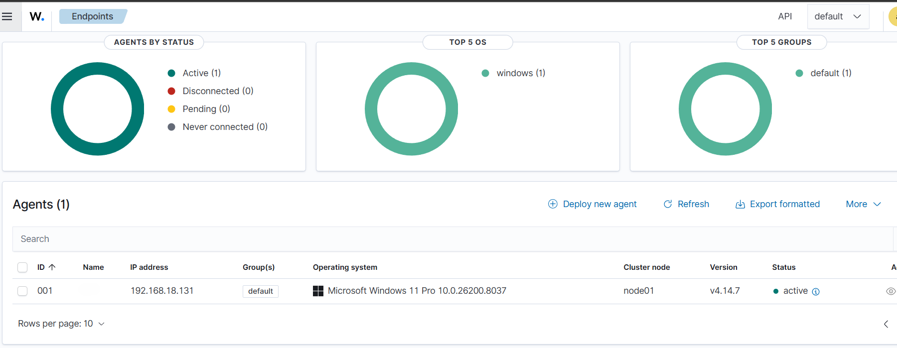

### Active Event Ingestion
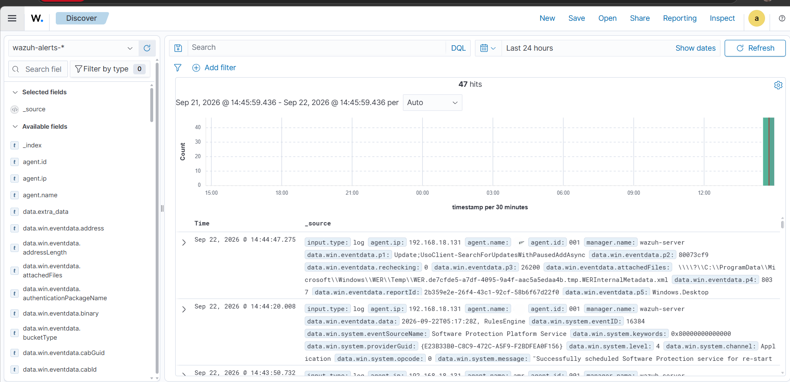

### Sysmon
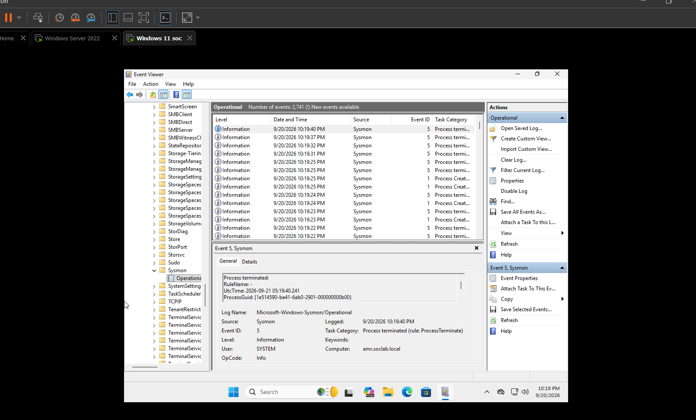

### Active Directory
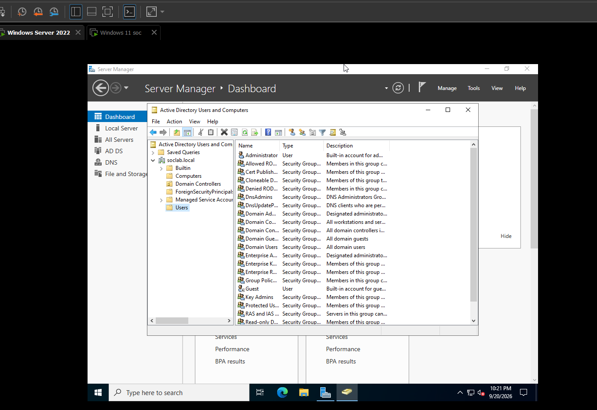

### 1) Failed logon — 3 incorrect password attempts
The screenshot below shows the Windows 11 VM login screen for user "SOC-User" after three consecutive incorrect password attempts. These failed logons generate Windows Security events and are visible in Wazuh after ingestion.

.png)

### 2) Wazuh Dashboard — Collected events from the failed logons
The Wazuh Discover view below demonstrates that Windows events from the endpoint were ingested. You can see raw event records and a chart representing the generated activity.

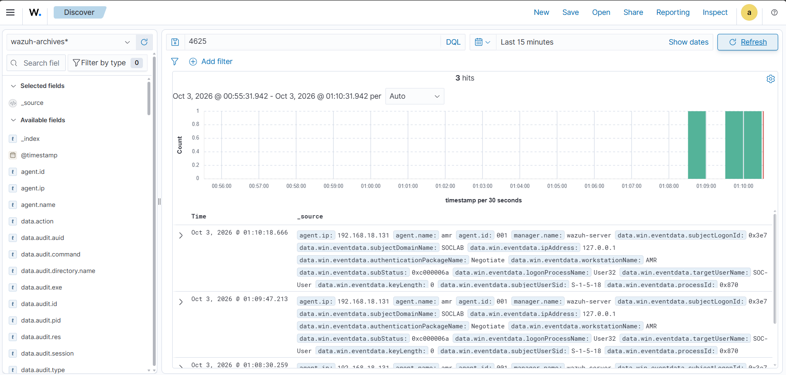

## 🛡️ Creating an alert rule for enabling the Windows Guest account

This example shows how I created a Wazuh detection rule to alert when the built-in Windows Guest account is enabled. The goal was to detect a specific account-change event and confirm that the alert was generated in the Wazuh dashboard.

### Step 1: Deciding which rule to create

In the first screenshot, I opened the local rule file and identified the event type I wanted to monitor. I decided to create a rule for the Windows account change event that indicates a user account was enabled.

The key conditions were:

- Windows event ID: `4722`
- Event type: a user account was enabled
- Target username: `Guest`

This is the exact scenario I wanted to detect: when the Guest account is enabled on a Windows machine.

### Step 2: The custom rule created in `local_rules.xml`

I added the following rule to the Wazuh local rules configuration:

```xml
<group name="windows,windows_security,account_changed,adduser">
  <rule id="100200" level="12">
    <if_sid>60103</if_sid>
    <field name="win.system.eventID">^4722$</field>
    <field name="win.eventdata.targetUserName">^Guest$</field>

    <description>(agent-name) Windows Guest was enabled.</description>

    <mitre>
      <id>T1078</id>
    </mitre>

    <group>
      windows,
      windows_account_management,
      account_enabled,
      guest_account,
    </group>
  </rule>
</group>
```

This rule does the following:

- `if_sid 60103` keeps the rule inside the Windows account-change event family.
- `win.system.eventID` matches event `4722`, which is the Windows event for enabling an account.
- `win.eventdata.targetUserName` matches the username `Guest`.
- The `description` field makes the alert readable in the Wazuh dashboard.

### Step 3: Confirming the event existed in the log data

The second screenshot shows the Wazuh Discover view. Here I verified that the raw event was actually present in the collected Windows telemetry.

The important part is the event data:

- `data.win.system.eventID: 4722`
- `data.win.eventdata.targetUserName: Guest`

This confirmed that the event was being ingested correctly before I relied on the alert rule to generate a detection.

### Step 4: Verifying the rule fired

The third screenshot shows the alert view in Wazuh. The first red arrow points to the alerts index (`wazuh-alerts-*`), which is where Wazuh stores generated alerts. The second red arrow points directly to the alert entry for the rule we created.

The generated alert message is:

> Windows Guest account was enabled.

This confirms that the detection worked. The rule matched the event, the alert was generated, and the suspicious activity was visible in the Wazuh alerts section.

### Why this is useful

This is a good example of a detection rule that connects an event to an attacker-relevant action. In this case, enabling the Guest account is a high-value security event because it can create an unauthorized access path or indicate an account manipulation attempt.

## 🔒 File Integrity Monitoring (FIM)

This section shows how I configured file integrity monitoring in Wazuh for both Windows and Linux hosts. The goal was to monitor a test file for changes, trigger alerts when the file was edited, and verify the detection process inside the Wazuh dashboard.

### Windows File Integrity Process

1. Create a test file on the Windows endpoint.

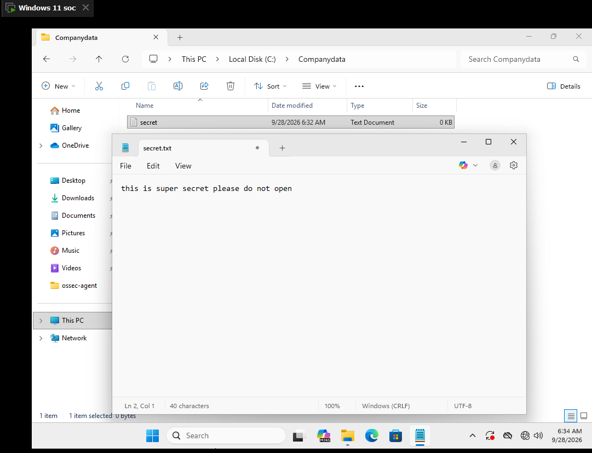

2. Add a file integrity rule for the example file in Wazuh.

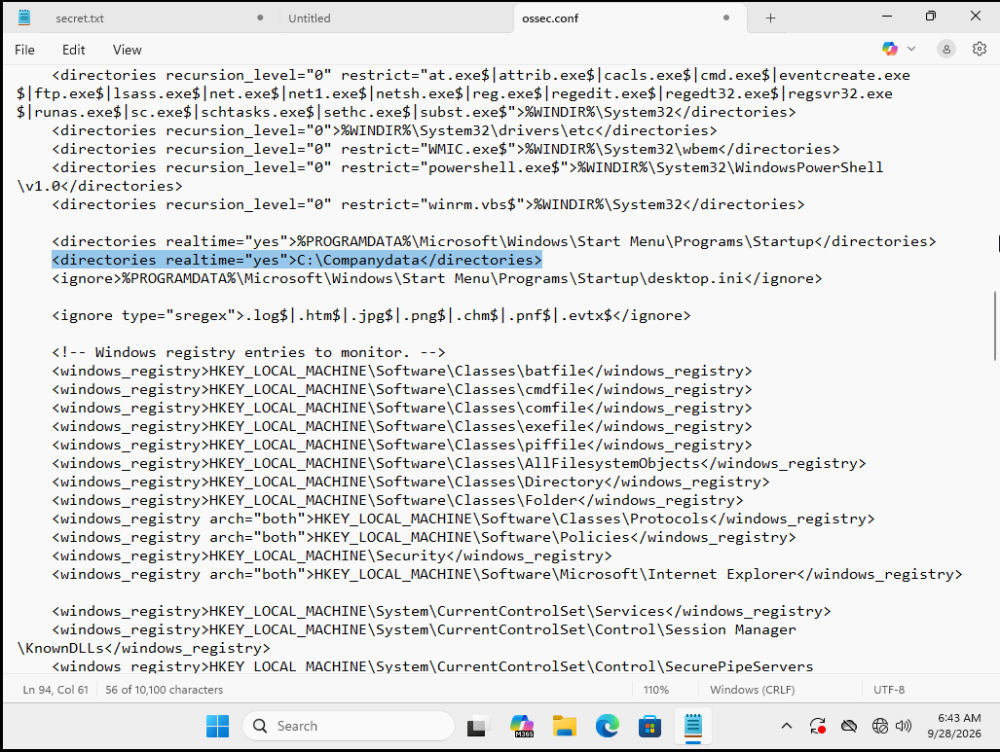

3. Edit the test file to trigger a change event.

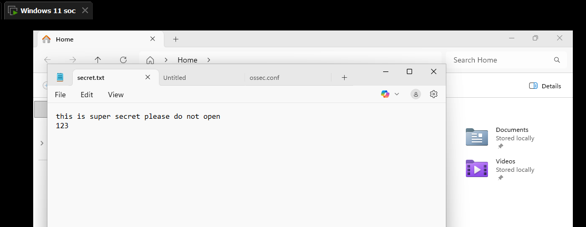

4. Confirm the alert in the Wazuh dashboard.

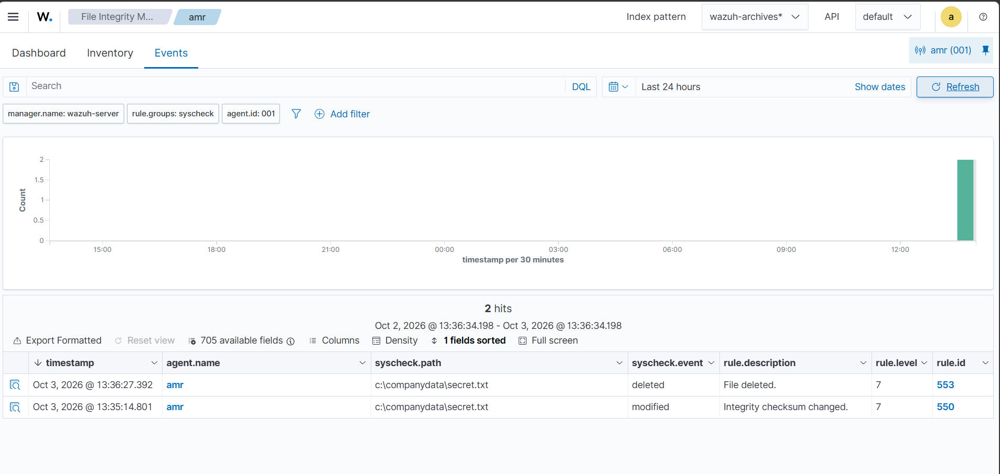

### Linux File Integrity Process

1. Create a test file on the Linux endpoint.

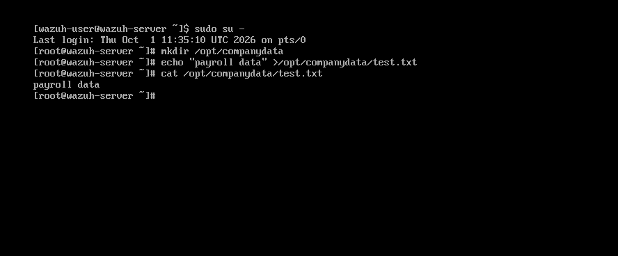

2. Add a file integrity rule for the Linux file.

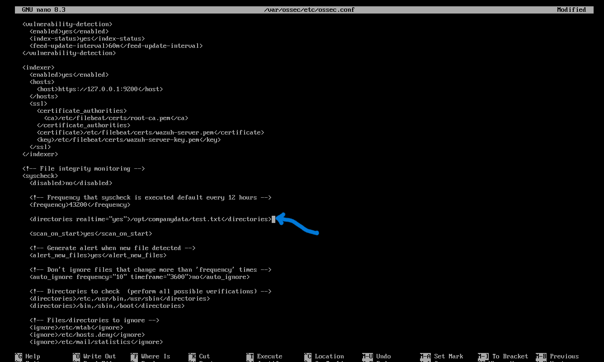

3. Modify the monitored file to trigger the integrity alert.

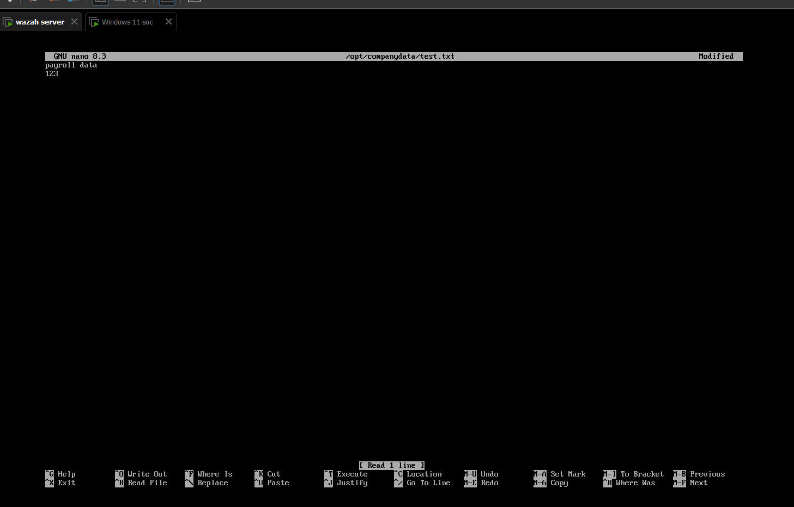

4. Validate the detection in Wazuh and review the changed content.

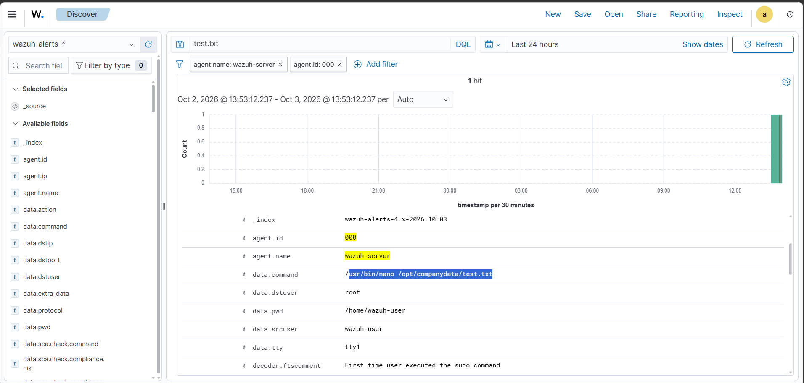

This process demonstrates how Wazuh File Integrity Monitoring can detect unauthorized or unexpected file changes across endpoints.
